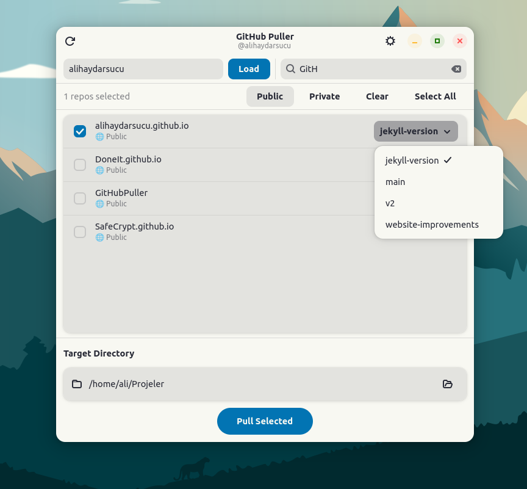
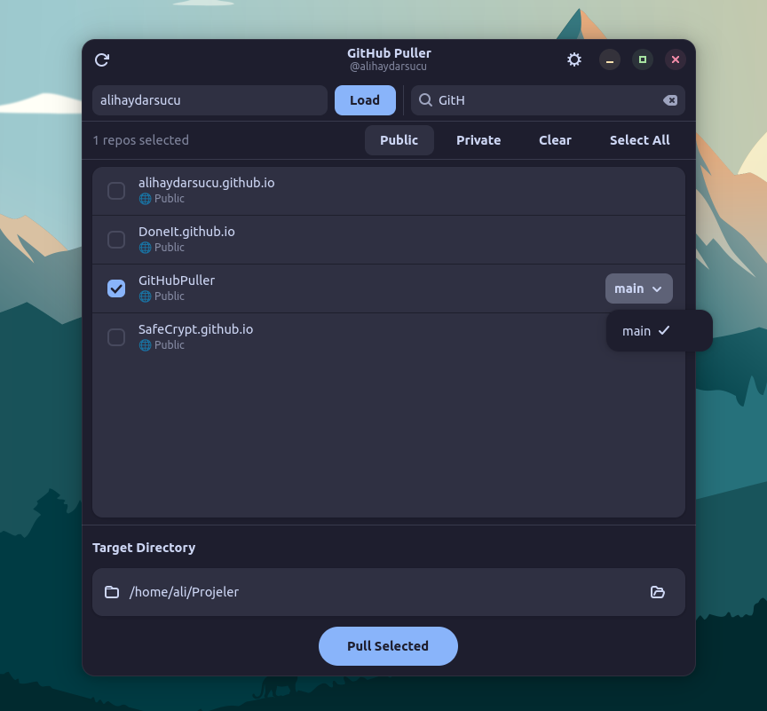

<div align="center">


# GitHub Puller

GTK4 + libadwaita application for cloning and updating multiple GitHub repositories.


</div>

## Features

- Built with GTK4 and libadwaita
- Search repositories by name
- Choose a branch per repository
- Supports private repositories with a GitHub token
- Clones missing repositories and pulls existing ones
- Processes repositories in parallel
- Lets you choose and save a target directory

## Screenshots

<div align="center">

| Light Mode | Dark Mode |
|------------|-----------|
|  |  |

*Modern GTK4 + libadwaita interface with adaptive theming*

</div>

## Installation

### Quick install

```bash
curl -fsSL https://raw.githubusercontent.com/alihaydarsucu/GitHubPuller/main/install.sh | bash
```

### Other options

<details>
<summary>Show alternative installation methods</summary>

**Flathub (planned):**
```bash
flatpak install flathub io.github.alihaydarsucu.GitHubPuller
```

**Manual installation:**
```bash
# 1. Install dependencies (Ubuntu/Debian)
sudo apt install python3-gi python3-gi-cairo gir1.2-gtk-4.0 gir1.2-adw-1 python3-pip git

# 2. Clone and install
git clone https://github.com/alihaydarsucu/GitHubPuller.git
cd GitHubPuller
./install.sh
```

**For developers:**
```bash
git clone https://github.com/alihaydarsucu/GitHubPuller.git
cd GitHubPuller
make dev
```

</details>

## Usage

1. Start the app: `github-puller`
2. Enter your GitHub username
3. (Optional) Add a GitHub token in Settings for private repositories
4. Select desired repositories
5. Set a target directory (default: `~/Desktop/Projects`)
6. Click **Pull Selected**

## GitHub Token

To access private repositories:
1. Go to GitHub → Settings → Developer settings → Personal access tokens
2. Create a new token
3. Give it `repo` permission
4. Paste it into the app settings

## Development

```bash
git clone https://github.com/alihaydarsucu/GitHubPuller.git
cd GitHubPuller
python3 -m venv venv
source venv/bin/activate
pip install -e .
```

## Contributing

Pull requests are welcome. For larger changes, opening an issue first is helpful.

## License

MIT. See `LICENSE`.